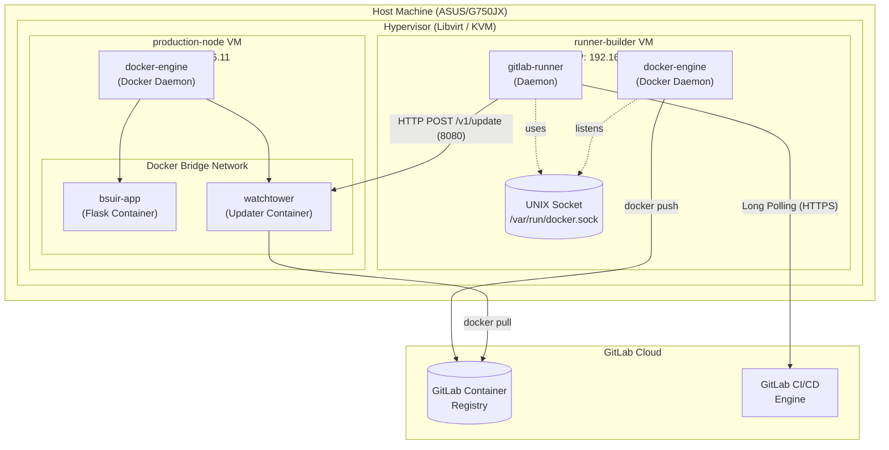
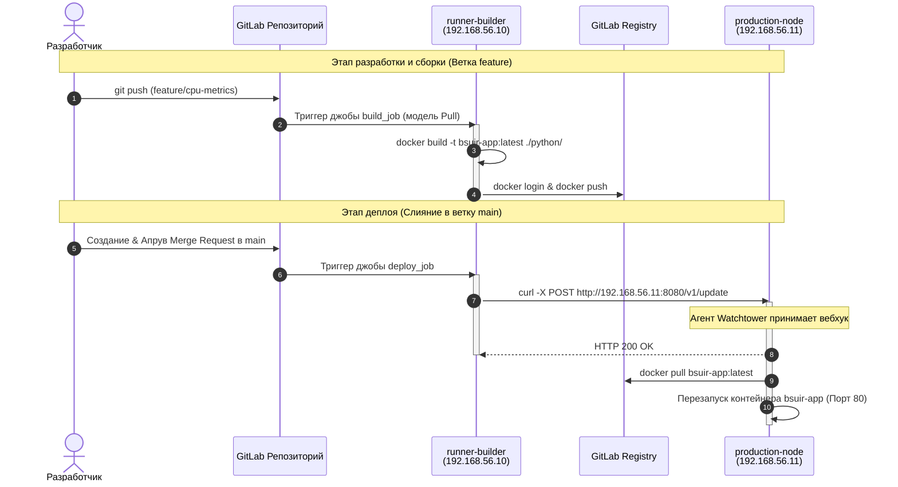
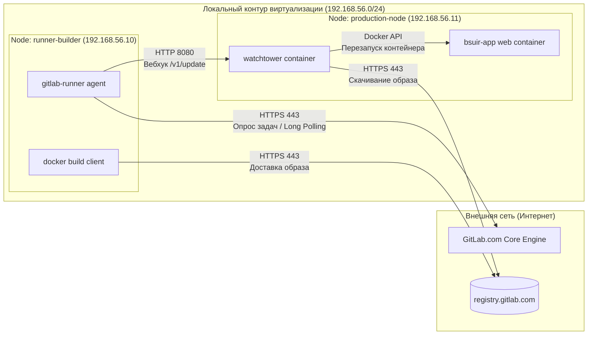

# Автоматизированная система интеграции и развертывания веб-приложения (Flask)

Данный репозиторий содержит лабораторный проект (Контрольная работа) по дисциплине, моделирующий полный цикл CI/CD в соответствии с методологией DevOps.

## Стек технологий и исходные данные
* **Вариант:** №6
* **Платформа VCS:** GitLab
* **Язык приложения:** Python (Flask)
* **Стратегия ветвления:** GitHub Flow
* **Инфраструктура:** IaC (Vagrant + Libvirt / KVM)
* **Целевая ОС виртуалки:** Ubuntu 24.04 LTS

---

## Архитектура стенда (Infrastructure as Code)

Развертывание тестовой среды полностью автоматизировано с помощью Vagrantfile мульти-нодовой конфигурации. Инфраструктура разделена на два изолированных узла, связанных приватной сетью (192.168.56.0/24):

1. **runner-builder (IP: 192.168.56.10)** Выделенный агент сборки. На борту развернут демон gitlab-runner и docker-engine. Сборка контейнеров изолирована и происходит по схеме проброса докер-сокета (/var/run/docker.sock) внутрь контейнера-сборщика.
2. **production-node (IP: 192.168.56.11)** Целевой сервер приложений (Продакшн). Содержит запущенное веб-приложение на порту 80 и легковесный агент Watchtower HTTP API, ожидающий хуков на обновление образов без прямого SSH-доступа со стороны CI/CD.

---

## Реализованный CI/CD Пайплайн (.gitlab-ci.yml)

Жизненный цикл изменений описывается двумя стадиями согласно стратегии бранчинга GitHub Flow:

### 1. Стадия build (Сборка и доставка)
* Срабатывает при любых пушах в репозиторий и при создании Merge Request.
* Использует изолированное окружение на базе образа docker:26.1.4.
* Выполняет авторизацию во встроенном GitLab Container Registry.
* Собирает обновленный Docker-образ Flask-приложения из директории ./python/ и пушит его в приватный реестр с тегом :latest.

### 2. Стадия deploy (Непрерывное развертывание)
* Запускается автоматически только при слиянии изменений в ветку main.
* Использует микроконтейнер curlimages/curl:latest.
* Отправляет авторизованный POST-запрос на вебхук агента автоматического обновления:  
  POST http://192.168.56.11:8080/v1/update
* Watchtower на продакшн-ноде перехватывает запрос, скачивает свежий образ из GitLab Registry, бесшовно гасит старый контейнер bsuir-app и запускает обновленную версию.

---

## Реализованная фича (Новый функционал)

В рамках GitHub Flow в ветке feature/cpu-metrics базовое демонстрационное приложение было доработано. Добавлен динамический DevOps-интерфейс, выводящий:
1. Текущий серверный таймстамп выполнения запроса контейнером (datetime).
2. Актуальную системную метрику загрузки процессора за последнюю минуту (System Load 1 min), считываемую напрямую из системного интерфейса ядра Linux /proc/loadavg.

---

## Инструкция по развертыванию и запуску локально

### Шаг 1: Подготовка окружения
Создайте локальный файл переменных окружения .env в корне проекта на хосте:
```
GITLAB_TOKEN=your_gitlab_runner_registration_token
WATCHTOWER_TOKEN=secure_secret_token_for_webhooks
REGISTRY_USER=your_gitlab_username
REGISTRY_PASSWORD=your_gitlab_personal_access_token
APP_IMAGE=registry.gitlab.com/your_username/your_repo:latest
```

### Шаг 2: Поднятие инфраструктуры
Запустите создание и конфигурацию виртуальных машин через Vagrant:
```
vagrant up --provider=libvirt
```
Скрипты provision-секции автоматически установят Docker, скачают и зарегистрируют GitLab-runner на хосте сборщика, настроят права доступа и поднимут Watchtower на прод-сервере.

### Шаг 3: Проверка работы
* Проверить статус раннера в интерфейсе GitLab (Settings -> CI/CD -> Runners).
* Веб-интерфейс развернутого приложения доступен по адресу: http://192.168.56.11:80.

## UML-диаграммы и структурные схемы для пояснительной записки

### 1. UML Диаграмма развертывания (Deployment Diagram)



### 2. UML Диаграмма взаимодействия (Sequence Diagram)



### 3. Структурная схема сетевых потоков данных

